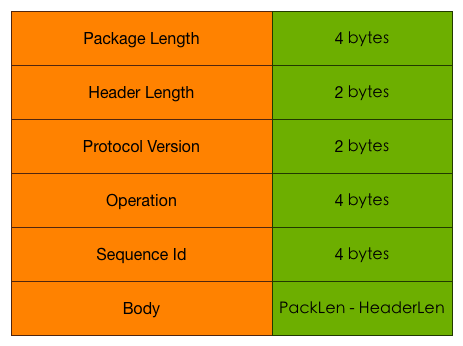

# 第九周作业

## 1. 总结几种 socket 粘包的解包方式: fix length/delimiter based/length field based frame decoder。尝试举例其应用

### fix length
包长度固定，可以直接从缓存里读取固定长度的字节解析。适用于发送接收种类少的特定信息，比如服务端只提供一种服务，而且信息长度是固定的。

比如有个服务提供汇率信息，请求消息就是两个货币编码一共6格子节（USDCHY）代表1美元兑换多少人民币。返回的就是一个64位浮点数，长度是8个字节。

发送|返回
---|---
USDCHY|6.5

### delimiter based
使用某几个特殊字符组合作为分隔符，每次读取的时候读到分隔符就停止，然后解析包。比较适合传递长度不固定，文本格式的数据，分隔符可以用文本中不会出现的字符作为分隔符。

同样是汇率信息，但是可以一次取得多个货币的信息, 结尾用逗号分隔。那么就可以每个包传递任意个汇率信息的组合。返回的也可以是文本的值,用逗号分隔每个包内的汇率值，分号用来分隔不同的数据包。例子如下

发送|返回
---|---
CHYUSDAUDJPY,|6.5,4.4,0.3;

### length field based frame decoder
给数据包增加一个消息头，里面包含了包的长度信息。读取的时候先读取消息头，（可以是固定长度，比如4个字节），然后再按这个长度读取消息体。这种方式可以传递几乎所有信息，

还是以汇率信息为例，这个服务可以提供更多信息，比如加上额度。比如下面这个例子：消息头表明消息体长度是17,消息体是100人民币可以兑换多少美元日元和澳元，返回消息头是24代表长度是24个字节，消息体则是3个64位浮点数代表对应每个货币的结果
发送|返回
---|---
17 CHY100,USDJPYAUD|24 65,70,3300

## 2. 实现一个从 socket connection 中解码出 goim 协议的解码器。
协议结构如下图所示

[]
### Operation
* Auth
* Heartbeat
* Message

